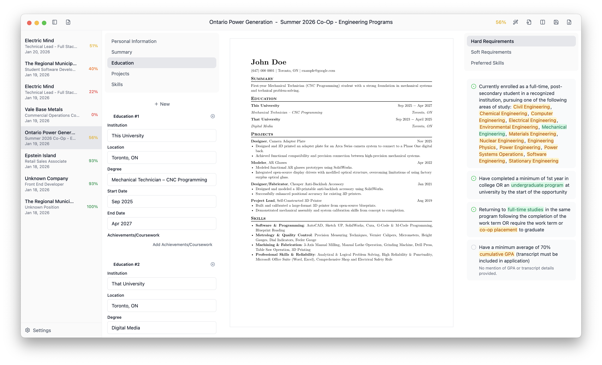

# Kairos

AI-powered resume tailoring for job seekers. Build, customize, and optimize
your resume for each application.

> [!WARNING]
> This app is in early development and may have bugs or unexpected behavior. AI
> can make mistakes when tailoring and parsing your resume - always review the
> output before submitting applications.

> [!NOTE]
> Kairos does not collect any user data. No telemetry, no analytics, no
> tracking.

> [!IMPORTANT]
> By using AI features, your resume content is sent to the LLM provider you
> configure (OpenAI, Anthropic, etc.). You are responsible for reviewing and
> agreeing to their terms of service and privacy policies.

[More screenshots](assets/screenshots/)

## Features

- **Real-time editing** - Live preview as you type
- **AI-powered tailoring** - Automatically optimize your resume for job descriptions
- **Batch applications** - One resume + multiple JDs = multiple tailored applications
- **Build from scratch** - Start fresh or use an existing application as a base
- **Keyword scoring** - Weighted scoring system to track requirement coverage
- **Flexible export** - Single PDF or batch export all applications
- **Full customization** - Sections, subsections, fields are all drag-and-drop reorderable
- **Document styling** - Font, margins, heading color, paper size
- **Dark/light theme** - System-aware appearance
- **Keyboard-first** - Shortcuts for speed and efficiency

### AI Providers

Bring your own API key:

- OpenAI
- Anthropic Claude
- Google Gemini
- DeepSeek
- xAI Grok
- Ollama (local models)

More providers will be supported once the app is stable in v1.0.0.

See [CHANGELOG.md](CHANGELOG.md) for version history and detailed feature notes.

## Installation

### macOS

1. Download the latest `.dmg` from [Releases](https://github.com/tianpai/kairos/releases)
2. Open the `.dmg` and drag Kairos to Applications
3. On first launch, macOS will warn about an unidentified developer:
   - Right-click the app → **Open** → **Open** again
   - Or run: `xattr -cr /Applications/Kairos.app`

Windows and Linux builds are available but less tested.

## Development

See [CONTRIBUTING.md](CONTRIBUTING.md) for setup instructions and technical documentation.

## License

[AGPL-3.0](LICENSE)
